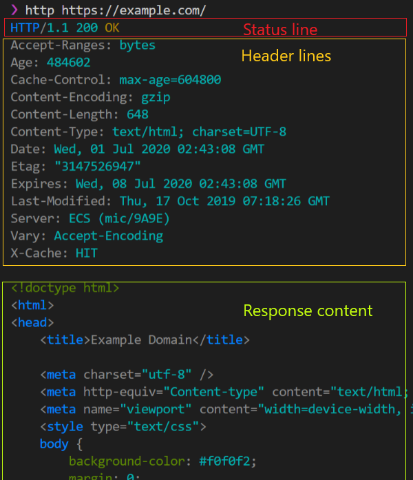
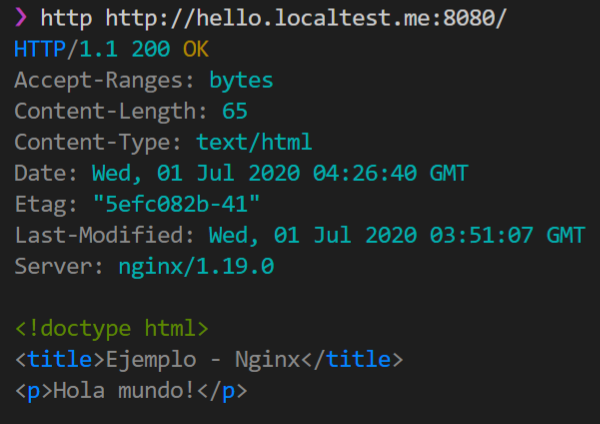
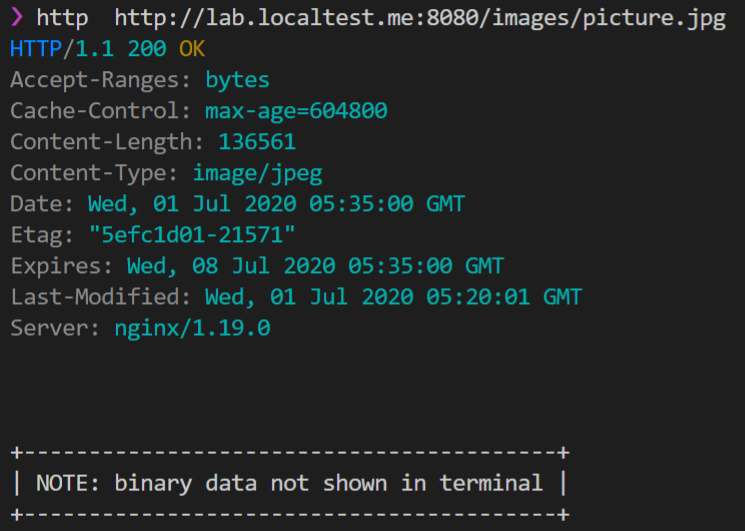

# Laboratorio - HTTP

El laboratorio consiste en revisar varias de las características de HTTP 
utilizando **Nginx** como servidor y **httpie** como cliente.

## Prerequisitos

* docker 19 o superior
* docker-compose 1.3 o superior
* Mac OS/Linux/Windows con WSL2
* Terminal bash o zsh

## Práctica

### Instalando un cliente de consola
Instala [httpie](https://httpie.org/):

```bash
apt-get install httpie
```

Prueba la instalación ejecutando 

```bash
http https://example.com/
```

El resultado del comando debería ser algo similar a esto:



La línea de status indica la versión de protocolo y el codigo de la respuesta,
en este caso, el código 200 representa una respuesta de éxito. Las líneas de
header representan metainformación de la respuesta como el tipo de contenido
e información de caché. Finalmente el contenido de la respuesta puede ser
cualquier información arbitraria, en este caso en específico es un documento
html.

### Configurando un contenedor de nginx usando docker-compose
Descarga y descomprime el contenido de [este repositorio](https://github.com/javiertoledos/lab1-http/archive/master.zip)

Abre una terminal e ingresa al directorio descomprimido e inicia 
los contenedores:

```bash
docker-compose up --detach
```

Puedes corroborar que el ejemplo está funcionando ejecutando:

```bash
http http://hello.localtest.me:8080/
```

Esto debera dar como resultado:



De la misma manera puedes acceder desde un explorador web ingresando a la misma
URL y deberías poder ver el texto `Hola mundo!`.

Para detener los contenedores recien iniciados, se corre

```
docker-compose stop
```

Entrando más a detalle, en el archivo `docker-compose.yml` se definen varios 
servicios. 

El primero, [traefik], es un reverse proxy que permite enrutar peticiones http a su destino que pueden ser otros servidores o contenedores. Esto lo logra a través
de una serie de reglas inspeccionando los encabezados http de la petición.

El segundo, `hello-world`, es un contenedor básico de nginx que expone el 
contenido del directorio `sites/hello-world/files` para el dominio 
`hello.localtest.me` (este dominio apunta a localhost).

El resto de servicios, `lab`, `whoami`, `whoami2` se utilizará para hacer
los ejercicios del laboratorio

## Ejercicios
1. Una característica de HTTP es la posibilidad de configurar encabezados de 
  expiración para evitar que un browser descarge innecesariamente un contenido 
  que no cambia con frecuencia. En el archivo `lab/conf.d/site.conf`, cambia la 
  configuración para que el contenido de la ruta `/images` envíe cabeceras de
  caché con una duración máxima de 7 días. Para una configuración correcta la 
  respuesta debe lucir similar a esta: 
    1. ¿Qué cabeceras envía un navegador (por ejemplo Chrome) en la petición
    para que la próxima vez no envíe de nuevo la imagen?.
    2. ¿Cuál es el código de estado que retorna el navegador para la imagen si
    esta no ha cambiado desde la última vez que el buscador la pidió?
2. Un problema de tener un servidor público de imágenes es que estas pueden ser
  invocadas desde otros sitios web, utilizando el ancho de banda de nuestros 
  servidores en usuarios ajenos a nuestros servicios. Esta situación es conocida
  como hotlinking. Configura la ruta `/images` para que prohiba la carga de la 
  imagen si la imagen no se carga directamente o desde el dominio
  `lab.localtest.me`. El código de respuesta debe ser 403 (forbidden). Puedes
  probar que funcione ingresando desde [hotlink.localtest.me:8080/hotlink.html]()
  y verificar que la imagen no se muestre, y luego visitar [lab.localtest.me:8080/hotlink.html]()
  y corroborar que la imagen se muestre exitosamente.
    1. ¿Qué cabecera utiliza el servidor para saber desde donde se está cargando
    una imagen?
3. Una de las características más poderosas de HTTP es la posibilidad de hosts 
  intermedios funcionando como proxies. En el caso de un proxy frente a un 
  servidor o grupo de servidores se le denomina "reverse proxy". Configura la 
  ruta `/proxy` en el archivo `lab/conf.d/site.conf` para que pueda distribuir 
  las peticiones equitativamente a los contenedores `whoami` y `whoami2`. Tip: 
  cuando usas docker-compose, los servicios se pueden "ver" entre ellos 
  utilizando el nombre que se les fue asignados (helloworld, lab, whoami y 
  whoami2) y estos son los nombres que se pueden usar en la configuración para
  el balanceo de carga.
    1. ¿Qué encabezados envía generalmente un reverse proxy al servidor de
      origen?

## Entrega
1. Sube una foto nueva con el nombre `picture2.jpg` a la carpeta de /images 
  mencionada en los ejercios.
2. Actualiza el archivo `index.txt` con tu número de carné y anota las 
  respuestas a cada inciso.
3. Crea un archivo zip con el nombre `lab1-<numero de carne>.zip`. Es requerido
  respetar este nombre ya que se evaluará con una herramienta automática el 
  laboratorio y en caso de no seguir instrucciones, no se evaluará la respuesta.
4. En el archivo zip se debe colocar el contenido modificado que se descargó al
  inicio de la práctica. Nuevamente, es importante que el archivo .zip tenga la 
  misma estructura de directorios:  
    **Correcto:**  
    ```
    lab1-20072089.zip
    ├── docker-compose.yml
    ├── nginx.conf
    └── sites
        └── ... subdirectorios
    ```
    **Incorrecto:**  
    ```
    laboratorio.zip
    └──lab1-http 
        ├── docker-compose.yml
        ├── nginx.conf
        └── sites
            └── ... subdirectorios
    ```

[traefik]: https://docs.traefik.io/
